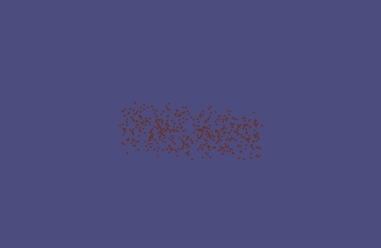
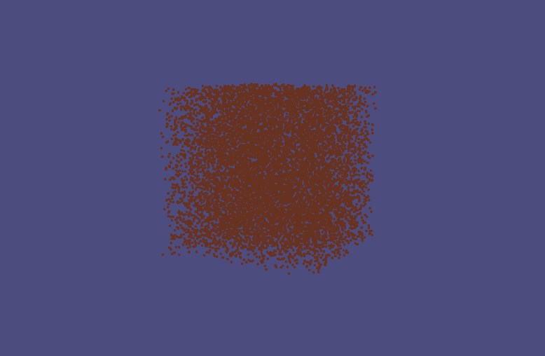
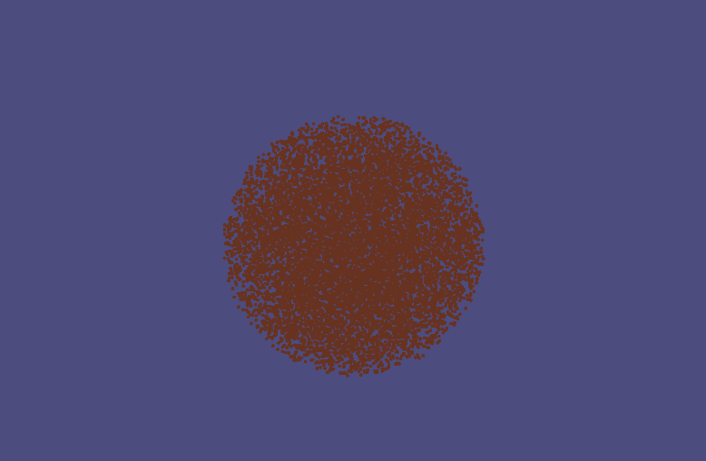
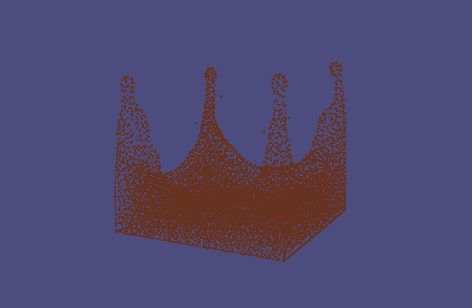

# CSC417 Final Project
Particle based fluid simulation
## Compilation

Starting in this directory, issue:
```
mkdir build
cd build
cmake ..
```
If you're using Mac or Linux, then issue:
```
make
```
## Execution

Once built, you can execute the assignment from inside the ```build``` using
```
./project.exe
```
We build three scenes to show our work, by pressing ```e```, ```w```, ```q```, you can change between different scenes.

While running, you can toggle the animation by pressing ```a```, and add a droplet in the scene by pressing ```s```.


## Built-in Scene

### Scene One: 
By pressing ```e```, you can see
a bar of liquid gradually becomes two separate drops of liquid due to surface tension.

<figure class="half" style="display:flex">
    
    
</figure>
### Scene Two:
By pressing ```w```, you can see a cube of liquid gradually changes into a ball due to surface tension without gravity.

<figure class="half" style="display:flex">
    
    
</figure>

### Scene Three:

By pressing ```q```, you can see a ball of liquid drops from the air to the ground.

<figure class="half" style="display:flex">
    
    
</figure>


## Presentation

Check our video [here](https://youtu.be/DPfGEZZug-8)
